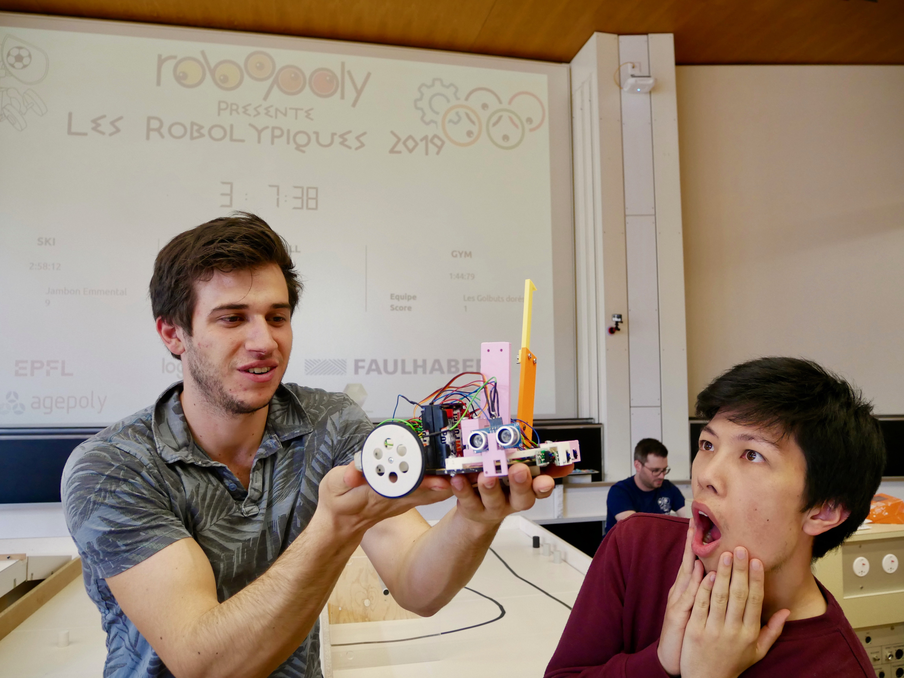

# Robot-contest

We achived second place at the contest Ropolympiques 2018-2019 of Robopoly.(https://www.epfl.ch/campus/associations/list/robopoly/evenements-2/gc2019/)

Here is our arduino code and the files stl and CADPART to construct our robot.

Format: 
